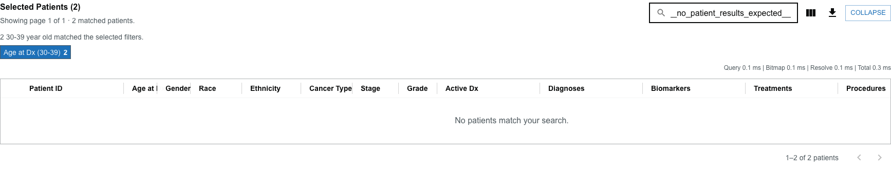
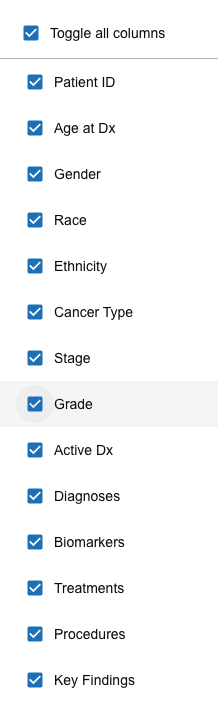
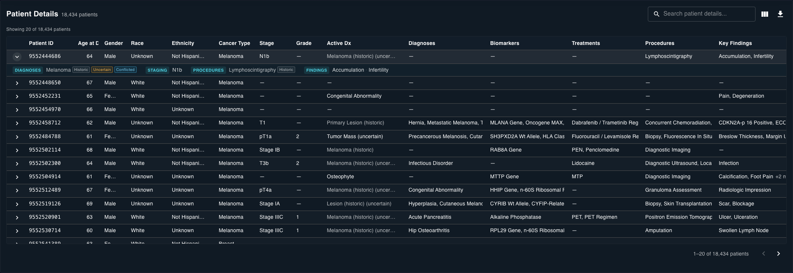

# The Selected Patients table

The cohort table in the [Selected Patients drawer](selected-patients.md) lists one patient per row. Most of its controls act on the **currently loaded page**, not on every page of the cohort.

## Search the loaded page

Type in **Search patient details...** to filter the visible rows. The search matches patient ID, demographics, cancer type, stage and grade, diagnoses, biomarkers, treatments, procedures, and findings.

The search applies only to the **rows currently loaded** in the drawer. If a patient is on another page, move to that page before searching for them.

If nothing on the page matches, the table shows **No patients match your search.**

## Sort and resize columns

- Click a sortable column header to cycle its sort state (ascending, descending, and off). Sorting applies to the **loaded rows** only.
- Drag the boundary on the right edge of a header to resize that column.
- Hover a truncated cell to see its full value in a tooltip.

## Choose visible columns

Open the column chooser to show or hide fields. Use **Toggle all columns** to turn every column on or off at once.

The CSV export includes only the columns that are currently visible — see [Export results](exporting-results.md).

## Loading, empty, and error states

- **Loading** — the table shows *"Loading patient details..."* while a page loads.
- **No results** — an empty search shows *"No patients match your search."*
- **Error** — if patient details fail to load, the table shows an error message and a **Retry** button. The cohort count can be ready before patient details finish loading, so a retry often succeeds on its own.

## Expand a row for patient detail

Click a row (or its chevron) to expand it and reveal that patient's grouped clinical detail. **Only one row stays expanded at a time** — expanding another collapses the first.

The expanded panel groups:

- diagnoses;
- staging;
- grading;
- biomarkers;
- treatments;
- procedures;
- findings; and
- behavior.

Items carry small indicators when they apply:

| Indicator | Meaning |
| --- | --- |
| **Negated** | The record states the finding is **absent** (for example, "no metastasis"). |
| **Historic** | The finding refers to the patient's history, not the current episode. |
| **Uncertain** | The record expresses uncertainty about the finding. |
| **Conflicted** | Sources disagree about the finding. |
| **source** | Notes where the value came from (for example, *via tumor*). |

## Open the full patient view

Select **Show in Document Viewer** in the expanded panel to open that patient as a tab in the drawer, with their cancer and tumor detail, document timeline, Patient Summary, and Document Viewer. See [Explore a patient](../explore-patient/overview.md).

You can also **right-click a patient's expanded detail** for a short menu:

- **Open in new tab** opens the patient as a tab. If that patient is already open, this **focuses the existing tab** rather than creating a duplicate.
- **Go to tab** appears when the patient already has a tab, and switches to it.

## Move between pages

Use the pagination controls to load another page. Remember that search, sort, and CSV export apply to the loaded page only.
