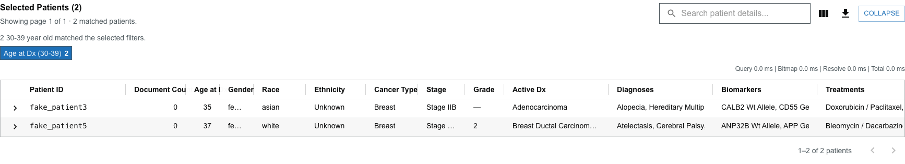

# Selected Patients drawer

The **Selected Patients drawer** holds the patient-level view of your cohort: a table of matching patients and any individual patients you have opened.

## When the drawer appears

The drawer becomes available when there is something to show — that is, when filters are active and a result is being resolved, **or** when you have opened a patient from a [patient dot](patient-dots.md). A patient tab keeps the drawer visible even if no filters are active.

## Above the drawer

The active-filter summary lists your current filter selections, each with a per-filter count, so you can see what defines the cohort at a glance.

## Tabs

The drawer opens on the **Selected Patients** table. Opening an individual patient adds a **patient tab** beside it. Select a tab to switch to it; select the close control (**×**) on a tab to close that patient. Opening a patient who already has a tab **focuses the existing tab** rather than creating a duplicate.

## Window controls

- **Minimize** collapses the drawer to its summary line.
- **Restore** reopens a minimized drawer.
- **Maximize** expands the drawer to fill most of the window; **Restore** returns it to normal size.
- **Double-click** an empty part of the drawer header to toggle the maximized state.
- **Escape** exits the maximized state, or collapses an expanded drawer.

## Page size

The drawer loads the cohort in pages:

- **10 patients per page** at normal size.
- **40 patients per page** when maximized.

Because maximizing changes the page size, it reloads the current view and may reset you to the first page. Use the pagination controls to move between pages.

Next: work with the cohort table in [The Selected Patients table](patients-table.md).
