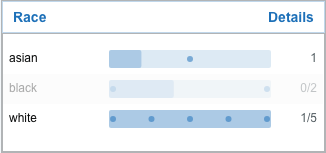
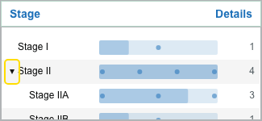

# Select and combine filters

## Select a value

Click a value's label or bar. Selected values are highlighted, and the card header reports how many values are selected.

Click a selected value again to remove it.

## Multiple values in one card mean OR

Values chosen within a single card are **alternatives**. Selecting both `Stage II` and `Stage III` includes patients matching **either** stage.

## Different cards mean AND

Selections in different cards combine to **narrow** the cohort. For example:

- Race: `White` or `Black`
- Stage: `Stage III`

The cohort must satisfy the race selection **and** the stage selection.

## Values that can't add anyone are disabled

As you add criteria, some values in other cards can no longer contribute any matching patient. Those values are **dimmed and cannot be selected**, because choosing one would reduce the cohort to zero. This prevents accidental empty results.

- A value is disabled when its included (in-cohort) count is **0** under the current criteria.
- A value you have **already selected** is never disabled, so you can always clear it — even if its in-cohort count has since dropped to zero.

## Hierarchical values

Some clinical cards group detailed values under a parent.

- Use the **expand control** beside a parent to reveal its children. Expanding a group does **not** select it — you can browse children without changing the cohort.
- Selecting a **parent** includes the underlying values it represents; the Visualizer translates the parent into those specific values when it runs the query.

Grouping is common for stage, grade, and behavior values.

## Age at diagnosis

Age may be offered as ranges for easier selection. When the query runs, a selected range is translated into the individual ages it represents.

## Reset filters

**Reset filters** in the toolbar does more than clear your selections. In one action it:

- clears all active filter values;
- restores each card's default sort order;
- collapses any expanded hierarchy groups;
- clears the search in the [Filter Details dialog](filter-details.md); and
- closes the Filter Details dialog if it is open.

Reset filters returns the Explorer to its unfiltered state. It does **not** change your theme, font size, or other display preferences.
