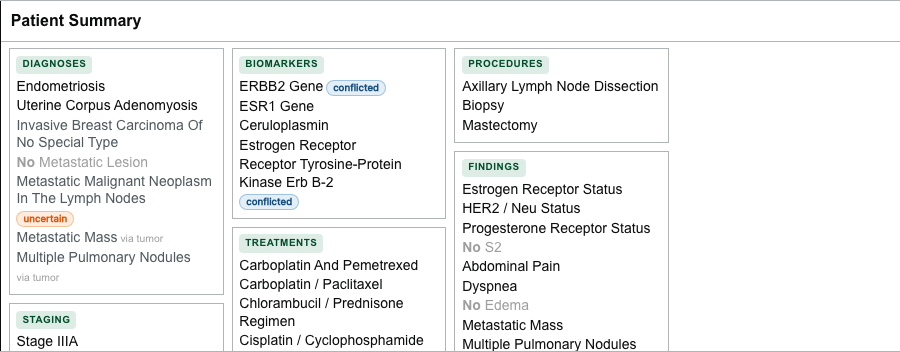

# View an individual patient

You can inspect an individual patient at two levels of detail from the Selected Patients drawer, and you can also open a patient directly from a filter bar.

## Expand a table row

Use the row expansion control to show grouped clinical details such as:

- diagnoses;
- staging;
- grading;
- biomarkers;
- treatments;
- procedures;
- findings; and
- behavior.

Only one table row remains expanded at a time.

## Open the patient view

Select **Show in Document Viewer** for a patient. The patient opens in a new tab inside the drawer.

The embedded patient view can contain:

- demographics;
- cancer and tumor summaries;
- a document timeline;
- source-document text;
- extracted concept overlays; and
- a structured Patient Summary Card when the supporting data is available.

When the supporting data is present, the **Patient Summary Card** groups diagnoses, staging, and biomarkers into a single structured overview.

Use the tabs at the top of the drawer to switch between **Selected Patients** and open patients. Select the close control on a patient tab when finished.

## Open from a filter bar

When a filter value matches a small number of patients, each patient appears as a **dot** on that value's bar.

- **Hover** a dot to preview that patient's summary.
- **Select** a dot to open that patient's document view as a tab in the drawer — even when no filters are active, and without changing the current cohort.

:::note

The exact patient sections depend on the data supplied by the DeepPhe services.

:::
