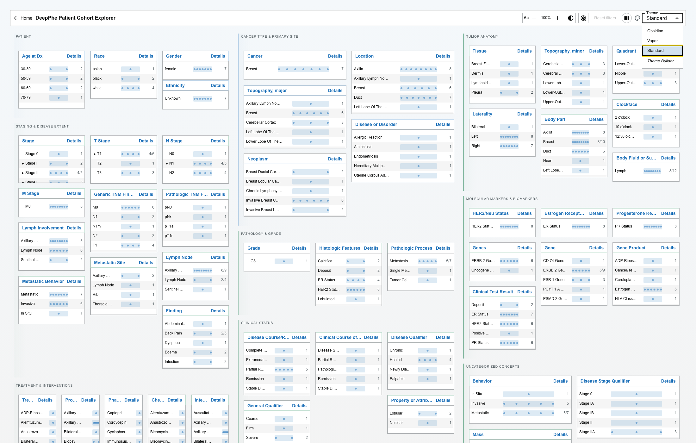

# Display settings

The toolbar's display controls change how the Cohort Explorer looks. **None of them change your filters or the cohort.**

## Font size

Use the **−** and **+** controls beside **Aa** to make the interface smaller or larger.

## High contrast

Select the **High contrast** control to strengthen foreground and boundary contrast. Select it again to return to the theme's standard contrast.

## Reduced motion

Select **Reduced motion** to minimize animation and transitions. The application also respects your operating system's reduced-motion preference.

## Bars behind dots

Select **Bars behind dots** to draw a faint proportional bar behind [patient dots](../cohort-explorer/patient-dots.md), giving scale while keeping the dots dominant.

## Layout

Use the **layout toggle** to switch between one card per column and a stacked flow layout. Use whichever reads better on your screen.

## Theme

Choose **Standard**, **Obsidian**, or **Vapor** from the **Theme** menu, or open the **Theme Builder** to customize colors. See [Theme and Theme Builder](theme-builder.md).

## What is remembered

Your browser stores most of these settings between visits: **theme**, **Theme Builder** color changes, **font size**, **high contrast**, **reduced motion**, and **bars behind dots**.

The **layout toggle** is **not** stored — it returns to its default when you reload the page.
