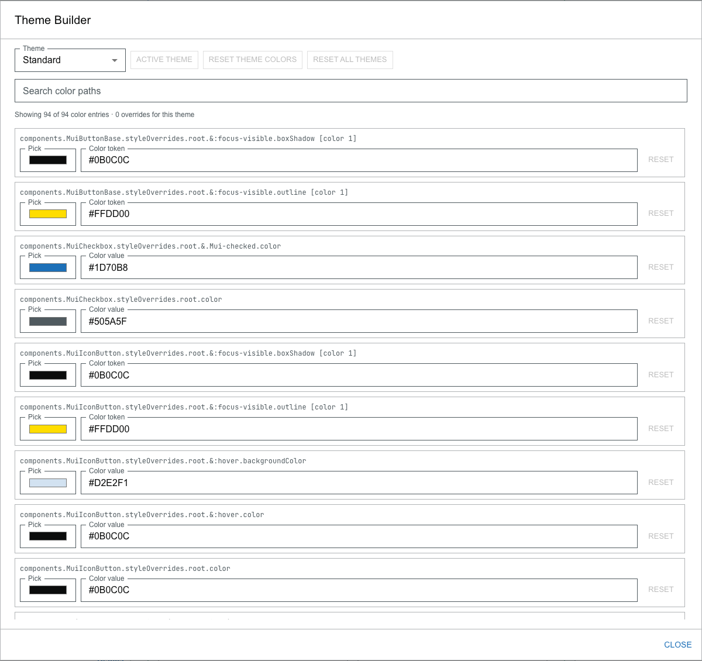

# Theme and Theme Builder

## Choose a theme

The **Theme** menu in the toolbar offers three supplied themes:

- **Standard**
- **Obsidian**
- **Vapor**

Choosing a theme changes only appearance, never your cohort. Your choice is stored by your browser between visits.

## Open the Theme Builder

Select **Theme Builder…** at the bottom of the **Theme** menu to open the Theme Builder, where you can override individual colors.

## Edit a theme's colors

1. In the Theme Builder's **Theme** menu, choose which base theme you want to edit.
2. Find a color to change. Use **Search color paths** to filter the list by **path** (for example, `palette.primary.main`) or by **value** (for example, a hex code). A readout shows how many entries match and how many overrides you have for this theme.
3. Change a color by picking one with the **Pick** color picker or by typing a **color value** (or color token) directly.
4. Undo one change with its **Reset**, or start the whole theme over with **Reset Theme Colors**.

Your color changes are stored by your browser, so an edited theme keeps its look between visits.

## Apply an edited theme

Editing a theme does **not** switch to it. To use the theme you are editing:

- Select **Use This Theme**. When the theme you are editing is already the one in use, that button reads **Active Theme**.

## Reset

- **Reset Theme Colors** clears your changes for the theme you are currently editing.
- **Reset All Themes** clears your color changes for **every** theme.

Both are available only when there are changes to clear.

Close the Theme Builder with **Close**; your changes and the active theme are kept.
