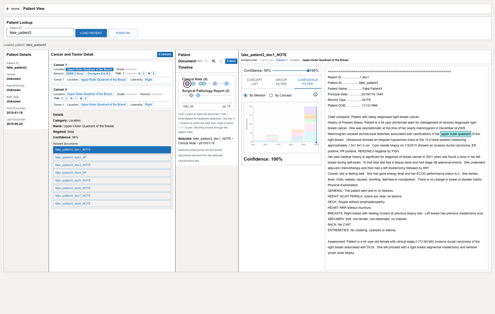

# Cancer and Tumor Detail

The **Cancer and Tumor Detail** panel presents a patient's cancers and tumors as structured **fact badges**. Selecting a fact opens the note it came from, so you can verify it against the source.

## What it shows

A patient may have more than one cancer, and each cancer may have one or more tumors. For each, the panel shows fact badges grouped by category — the groups that appear depend on the available data, and can include:

- **Location**;
- **Grade**;
- **Genes**;
- **TNM** stage; and
- other data-dependent groups.

Cancer-level facts describe the cancer overall; tumor-level facts describe a specific tumor.

Use the collapse/expand control in the panel header to fold the panel to a slim strip and back, giving more room to the other cards.

## Select a fact

Select a fact badge to focus it. When you do:

- Its detail is shown, which can include the **category**, **name**, **negated** status, and **confidence**.
- If the fact is linked to a source note, that note opens in the [Document Viewer](document-viewer.md).
- Notes related to the fact are marked on the [Patient Document Timeline](document-timeline.md) with **dashed outlines**, so you can see where the fact is documented.

Select the same fact again to clear it and its highlights.

:::note

Not every fact links to a note. When a fact has no resolvable source note, selecting it focuses the fact but does not open a document.

:::

Related notes shown for a fact carry their own context in the Document Viewer's breadcrumb — see [Use the Document Viewer](document-viewer.md#where-the-document-came-from).
