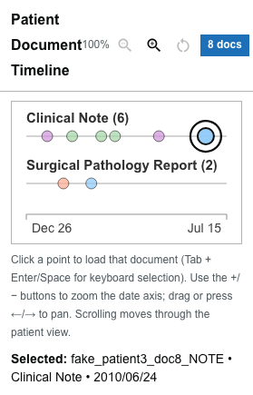

# Patient Document Timeline

The **Patient Document Timeline** plots a patient's notes over time so you can pick the one you want to read.

## Read the timeline

- **Report types** are arranged as **rows** (for example, pathology, clinical notes).
- Each **document** is a point positioned by its **date**.
- **Episode colors** group documents that belong to the same care episode.
- A **document count** near the heading shows how many notes the patient has.

## Zoom into a date range

The chart has two parts:

- The **detail view** on top shows the documents in the selected date range. Its date axis always runs from the start to the end of that range.
- The **overview strip** underneath always shows the patient's full date range. A small tick marks every document, in its report type's row and episode color. The dates at its left and right ends never change.

Two handles on the overview strip select the range the detail view shows.

- **Drag a handle** to move that end of the range. Each handle shows its date underneath while you are zoomed in. The handles cannot cross.
- **Drag the shaded window** between the handles to move the range without changing its length.
- **Press the strip outside the window** to center the range there.
- Use the buttons beside the heading to **zoom in**, **zoom out**, **pan earlier**, **pan later**, or **reset** to the full range. The percentage shows the current zoom, up to 1600%.
- When zoomed in, you can also **drag the detail view** sideways to pan.

Scrolling the mouse wheel over the chart scrolls the page; it does not zoom.

With the keyboard:

| Key | Where | Action |
| --- | --- | --- |
| `+` / `-` | Anywhere in the chart | Zoom in / out |
| `0` | Anywhere in the chart | Reset to the full range |
| `←` / `→` | A document point | Pan earlier / later |
| `←` / `→` | A handle or the window | Move it by 5% of the full range (**Shift**: 20%) |
| `Home` / `End` | A handle or the window | Move to the start or end of the full range |

Screen readers announce the selected range, for example "Showing Nov 22, 2010 to Mar 4, 2011", shortly after you stop changing it.

### Linked to the Event Timeline

When the patient also has an [Event Timeline](event-timeline.md), the two timelines are linked:

- They share one date range, wide enough for every document and every event. If events go back further than the first document, the document timeline starts earlier too, with empty space before its first document.
- Moving a handle, a button, or a key in either timeline moves both.
- Their overview strips, handles, and date axes line up, so a date sits directly above the same date in the other timeline.

The strips line up on screens at least 620 pixels wide. On narrower screens the timelines stay linked but do not line up.

A handle released within a few pixels of either end snaps to that end.

## Open a document

- **Click a point** to open that document in the [Document Viewer](document-viewer.md).
- With the keyboard, move focus to a point and press **Enter** or **Space**.
- The **currently open** document is drawn as a larger point with a ring around it, so you can see where you are.
- Points for documents linked to a selected [cancer or tumor fact](cancer-tumor-detail.md) or a [Patient Summary](patient-summary.md) item are drawn with **dashed outlines**.

## When dates collapse

Sometimes a dataset does not carry usable, distinct timestamps — for example, when every note resolves to a single date. When that happens, the ordinary date-positioned timeline is replaced by **episode dropdowns**:

{/* Uncomment once a collapsed-date patient is captured (set COLLAPSED_DATE_PATIENT_ID) & committed:

*/}

- Each episode has a dropdown labeled with the episode and its document count.
- **Show all documents** keeps every document in that episode visible.
- **Hide this episode** removes that episode's documents from view; the timeline reports how many documents are hidden.
- Choose a specific document from the dropdown to open it.

:::note

The episode-dropdown controls appear **only** when timestamps collapse. Most patients show the ordinary date-positioned timeline.

:::
