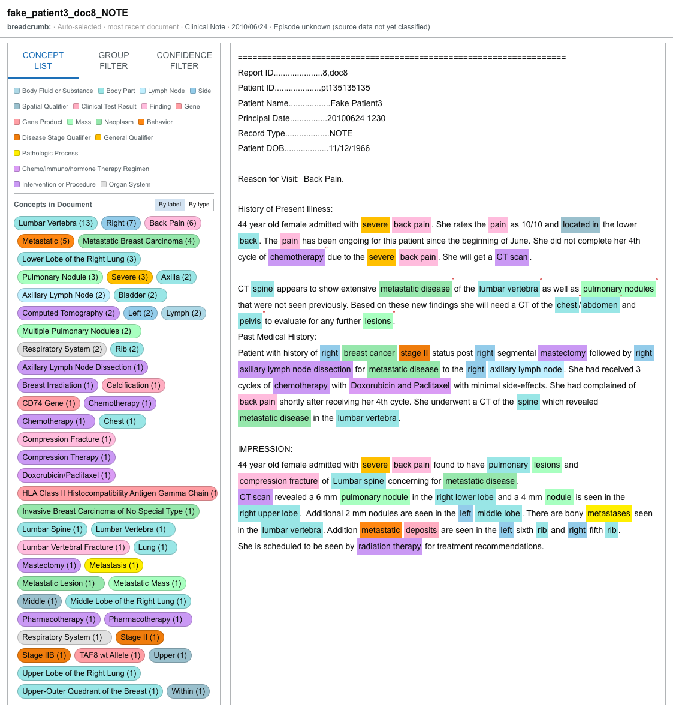
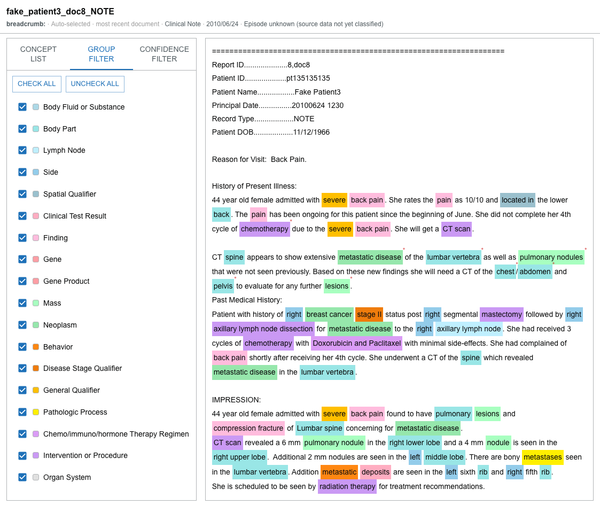
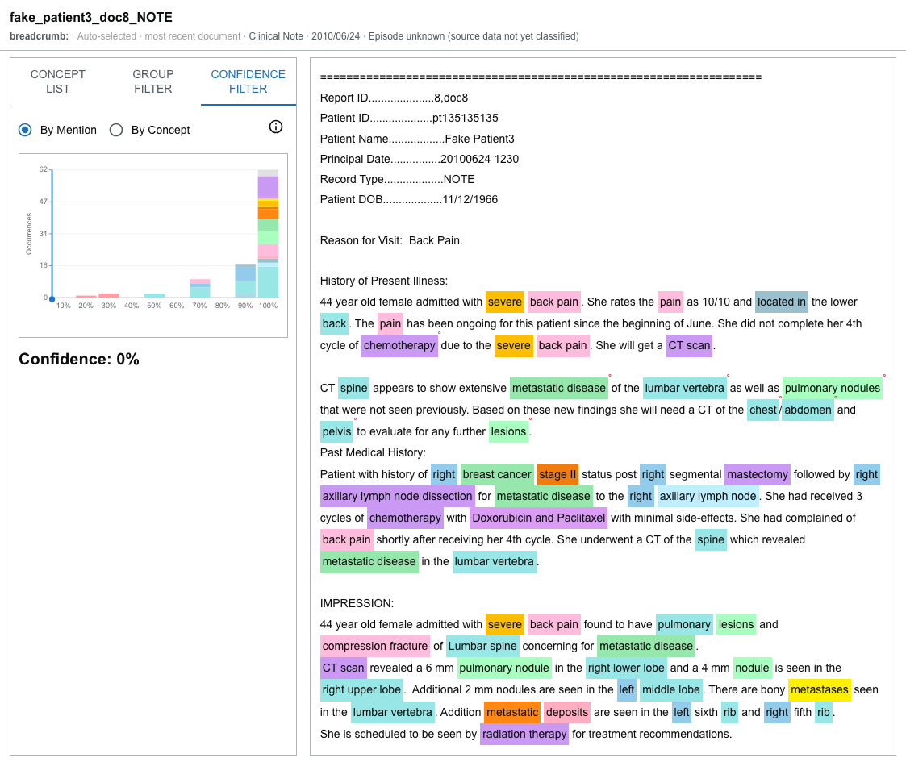

# Use the Document Viewer

The **Document Viewer** shows the text of a source note and highlights the clinical concepts found in it. It is where you confirm a finding against what the record actually says.

## Open a document

A note opens in the viewer when you:

- open a patient (the **most recent** note opens automatically);
- select a point on the [Patient Document Timeline](document-timeline.md);
- select a [cancer or tumor fact](cancer-tumor-detail.md);
- select an item in the [Patient Summary](patient-summary.md); or
- select a **linked** note related to a fact.

In the embedded patient view, a **Close document** control returns focus to the rest of the view. Use the collapse/expand control in the card header to fold the whole viewer to a slim strip and back. Within the viewer, the **concept column** has its own collapse control, so you can widen the note text when you don't need the concept list.

## Where the document came from

A **breadcrumb** line under the title tells you how the current note was chosen. It names the source context — for example:

- **Auto-selected · most recent document**;
- **Timeline**;
- **Cancer fact** or **Tumor fact**;
- **Linked document**; or
- **Patient summary**.

Where available, it also shows the document **type**, **date**, and **episode**. For a Patient Summary selection, it can show the **confidence** and the number of **sources** the finding was drawn from.

## Concept List

The **Concept List** tab lists the concepts found in the current note and drives the text highlights.

- A **legend** maps each concept group to a color.
- Each concept shows its **mention count** in the note.
- **Group by label** lists concepts alphabetically; **Group by type** groups them by concept family.
- Select one or more concept **chips** to focus them; **Clear** removes the focus. When chips are focused, the other concepts are **de-emphasized** in the text.
- Click a highlighted **text mention** to toggle its concept on or off.
- A **negated** mention (a concept recorded as absent) is marked as such.
- Hover a mention for its details — the **concept**, **group**, **confidence**, and its **negated**, **uncertain**, and **historic** status.

## Group Filter

The **Group Filter** tab turns whole concept groups on or off.

- Enable or disable a group with its checkbox.
- **CHECK ALL** and **UNCHECK ALL** switch every group at once.
- Disabling a group removes its highlights from the text.

## Confidence Filter

The **Confidence Filter** tab hides mentions below a confidence threshold.

- Drag or click the **histogram** to set the threshold; the current **confidence percentage** is shown.
- Mentions below the threshold are filtered out of the text.
- **By Mention** counts **every** mention in each confidence bucket.
- **By Concept** counts each concept **once**, using its highest-confidence mention.
- A **help** control explains the difference between the two counting modes.

## When a note has no text

Some documents arrive without their full text. When that happens, the viewer shows a notice — *"This document payload does not include text. Mention overlays require full text."* — because the highlights and concept overlays need the note's text to place them.

:::caution

Concept highlights are produced by natural-language processing and may be incomplete or wrong. Read the surrounding text and confirm important findings against the source record.

:::
