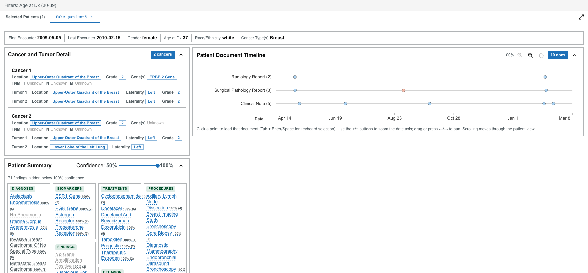

# View an individual patient

Opening a patient lets you move from a cohort-level summary to the **source notes** behind each finding. There are two ways to view a patient, and they differ in what they show.

## Two ways to open a patient

**Embedded patient view (inside the Selected Patients drawer).** This is the richer view. Open it from the Cohort Explorer by:

- clicking a [patient dot](../cohort-explorer/patient-dots.md) on a filter card, or
- expanding a row in the [Selected Patients table](../cohort-explorer/patients-table.md) and selecting **Show in Document Viewer** (or right-clicking the row and choosing **Open in new tab**).

The patient opens as a tab in the drawer.

**Standalone Patient View (from Home).** A separate page where you look a patient up by ID. It shows demographics, cancer and tumor detail, the document timeline, and the Document Viewer, but **not** the structured Patient Summary. See [Standalone Patient View](standalone-patient-view.md).

## What the embedded view contains

Depending on the available data, the embedded view can include:

- **Patient overview** — demographics such as first and last encounter, gender, age at diagnosis, and race.
- **[Cancer and Tumor Detail](cancer-tumor-detail.md)** — structured cancer- and tumor-level facts you can select.
- **[Patient Document Timeline](document-timeline.md)** — the patient's notes plotted over time.
- **[Patient Summary](patient-summary.md)** — diagnoses, staging, biomarkers, treatments, and more, grouped into a structured card.
- **[Document Viewer](document-viewer.md)** — the text of the selected note, with concept highlights and filters.

:::note

Sections are **omitted when their supporting data is unavailable**. If a patient has no structured summary, the Patient Summary card does not appear; the same is true of the other sections.

:::

## Follow a finding to its source

The most powerful thing this view does is let you **trace a finding to the note it came from**:

- Select a fact in [Cancer and Tumor Detail](cancer-tumor-detail.md), or a linked item in the [Patient Summary](patient-summary.md), to open its source note in the [Document Viewer](document-viewer.md).
- Related notes are marked on the [timeline](document-timeline.md) so you can see where a finding is documented.

Always confirm extracted findings against the source note before relying on them clinically.
