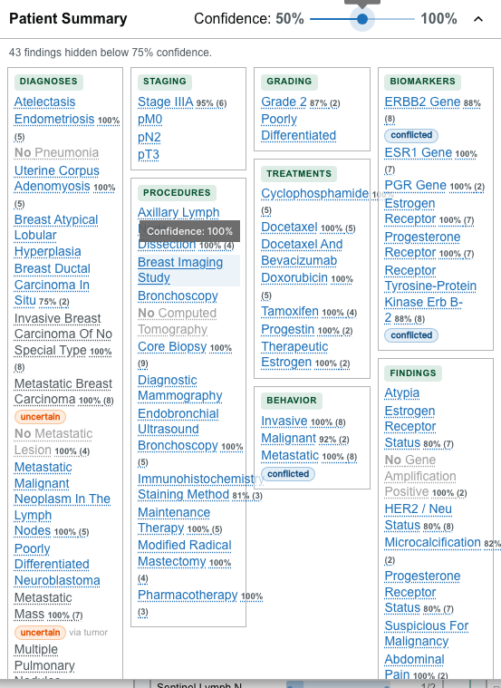
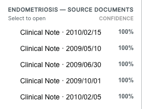

# Patient Summary

The **Patient Summary** card gives a structured, at-a-glance overview of a patient and lets you jump from any finding to the note it came from. It appears in the [embedded patient view](overview.md) when the patient has summary data.

## What it groups

The card organizes findings into sections, shown when data is present:

- diagnoses;
- staging;
- grading;
- biomarkers;
- treatments;
- procedures;
- findings; and
- behavior.

Use the collapse/expand control in the card header to fold the card to a slim strip and back.

## Reading the indicators

Items are styled to convey clinical meaning:

- **Negated** items (findings recorded as absent) are struck through and dimmed, and read as "No …".
- **Historic** items appear muted.
- **Uncertain** and **Conflicted** items carry a small labeled chip.
- A **source** label notes where a value came from.

## Filter by confidence

Each finding carries an **extraction confidence** — how sure the natural-language processing was about it. A **Confidence** slider in the card header hides findings below a chosen threshold so you can focus on the most certain results.

{/* Add once the screenshot is captured & committed:

*/}

- Drag the slider between **50%** and **100%** (in 5% steps) to set the minimum confidence.
- Findings below the threshold are hidden, and a live message reports how many — for example, *"3 findings hidden below 85% confidence."*
- Findings with **no confidence score** are always kept, so nothing is silently dropped for lack of a score.
- If nothing meets the threshold, the card says so and prompts you to lower it.

:::note

The threshold starts at its **maximum (100%)**, so until you lower the slider the card shows only findings extracted with full confidence — plus any finding that has no confidence score. Lower the slider to reveal more.

:::

## Follow an item to its source note

An item that resolves to one or more source notes is shown as an **interactive link**:

- A **single-source** item opens its source note directly in the [Document Viewer](document-viewer.md).
- A **multi-source** item shows a **count** (for example, "(4)") and, when clicked, opens a **document picker** listing its sources.

In the picker:

- sources are **ranked by confidence**, highest first;
- the **highest-confidence** source is labeled;
- the note that is **currently open** is marked; and
- choosing a note opens it in the Document Viewer.

Selecting the same **single-source** item again clears the selection and closes its note.

:::note

Not every summary item has a resolvable source note. Items that cannot be tied to a note are shown as plain text rather than links.

:::
