# Filters Workflow (`/filters`)

Primary workflow route: `/filters`.

## Page Overview

*Figure 02. `Patient Cohort Explorer` main layout with context panel, theme selector, and filter sets.*

*Figure 03. `Identified Patients` context panel with active cohort summary region.*

## Theme Selector (`Theme`)

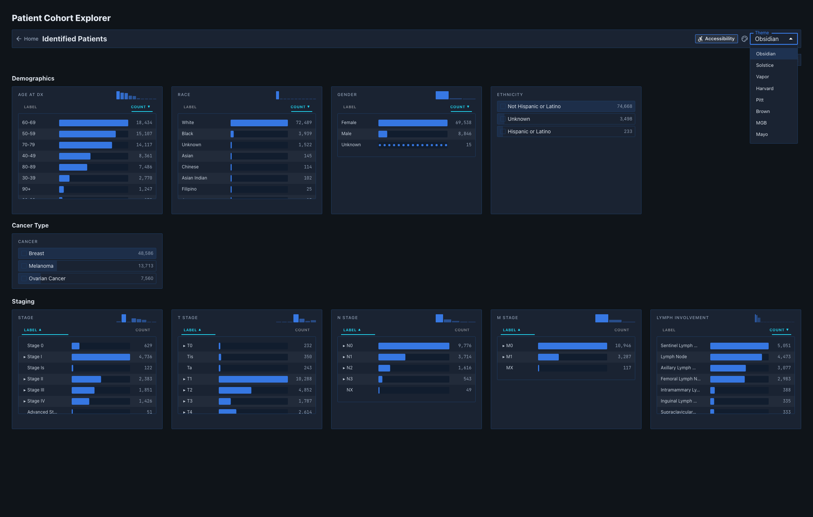
*Figure 04. Theme menu expanded with `Obsidian`, `Solstice`, and `Vapor` options.*

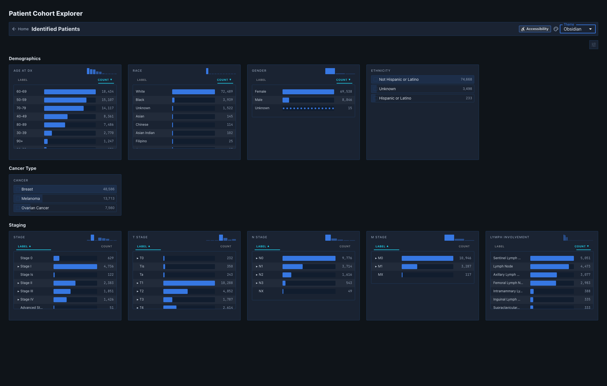
*Figure 05. Filters view rendered in `Obsidian` theme state.*

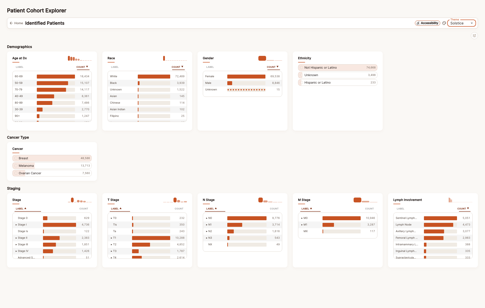
*Figure 06. Filters view rendered in `Solstice` theme state.*

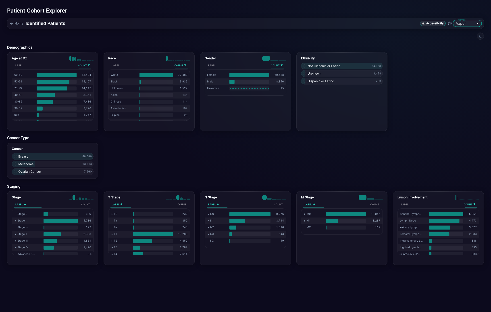
*Figure 07. Filters view rendered in `Vapor` theme state.*

## Filter Set: Demographics

*Figure 08. `Demographics` filter set section in the primary workflow.*

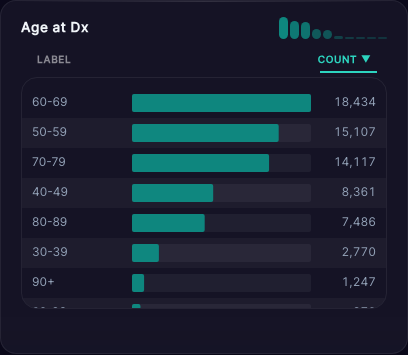
*Figure 09. `Age at Dx` filter card capture.*

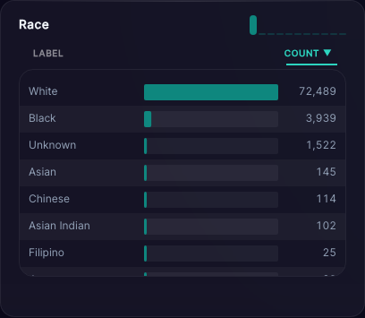
*Figure 10. `Race` filter card capture.*

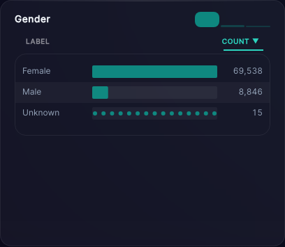
*Figure 11. `Gender` filter card capture.*

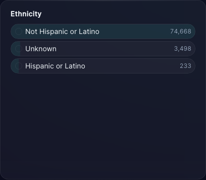
*Figure 12. `Ethnicity` filter card capture.*

## Filter Set: Cancer Type

*Figure 13. `Cancer Type` filter set section.*

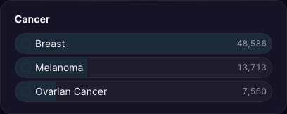
*Figure 14. `Cancer` filter card capture.*

## Filter Set: Staging

*Figure 15. `Staging` filter set section.*

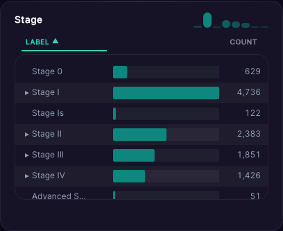
*Figure 16. `Stage` filter card capture.*

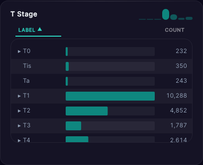
*Figure 17. `T Stage` filter card capture.*

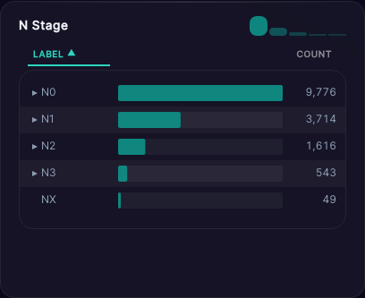
*Figure 18. `N Stage` filter card capture.*

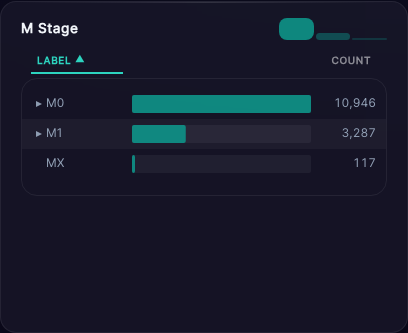
*Figure 19. `M Stage` filter card capture.*

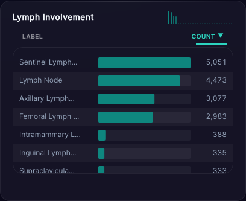
*Figure 20. `Lymph Involvement` filter card capture.*

## Active Selection State

*Figure 21. Filter UI after selecting at least one value to activate cohort filtering behavior.*
