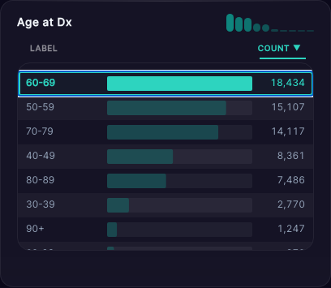

# DeepPhe Visualizer v3 UI Review

## Leadership Summary

This review documents the current user-facing state of DeepPhe Visualizer v3 using automated Playwright captures of the live application routes. The primary workflow (`/filters`) was validated for page framing, filter taxonomy coverage, theme switching, filter selection behavior, patient details controls, and supporting operational routes (`/debug`, `/accessibility`). The result is a reproducible evidence pack designed for release-readiness discussions, stakeholder walkthroughs, and regression baselining.

*Figure 01. Home route used as navigation hub for all reviewed views.*

## Primary Workflow Findings (`/filters`)

The `Patient Cohort Explorer` page presents a clear workflow: a context summary (`Identified Patients`), global theme controls, and grouped filter cards under `Demographics`, `Cancer Type`, and `Staging`. All required card labels were captured, and at least one filter value was programmatically selected to validate active-state behavior.

*Figure 02. Main explorer framing and top-level workflow layout.*

*Figure 21. Confirmed active selection state after scripted filter interaction.*

Theme accessibility options (`Obsidian`, `Solstice`, `Vapor`) were exercised directly through the `Theme` control, and card-height toggle automation executed both normalized and fit-content modes during capture.

## Patient Details Findings

When patient detail data was available, captures validated search, column visibility controls, CSV export action, table header structure, expandable detail rows, and empty-search behavior. If upstream API response shape or cohort data prevented one of these states from rendering, the automation captured fallback UI and logged the missing state for explicit tracking.

*Figure 22. Patient details area and operational controls.*

*Figure 23. `Toggle all columns` and column-level visibility options.*

*Figure 24. Expanded-row clinical details view, when data is present.*

*Figure 25. Confirmed no-match behavior for patient-detail search.*

## Secondary Route Findings

Operational pages (`/debug`, `/accessibility`) were captured to document behavior outside the primary cohort route and to preserve evidence for UI regression checks.

*Figure 30. Debug instrumentation surface for data-distribution troubleshooting.*

*Figure 31. Accessibility statement and audit-tool references.*

## Runtime Availability Notes

<!-- CAPTURE_NOTES_START -->
- All required UI states were captured successfully in this run.
- Card height toggle automation exercised both states: normalized and fit-content.
<!-- CAPTURE_NOTES_END -->

## Conclusion

The pipeline now produces repeatable visual QA evidence from live routes and exports a leadership-ready PDF artifact from the MKDocs `full-report` page. This gives the team a deterministic review workflow for release checkpoints and targeted regression comparison across future UI iterations.
