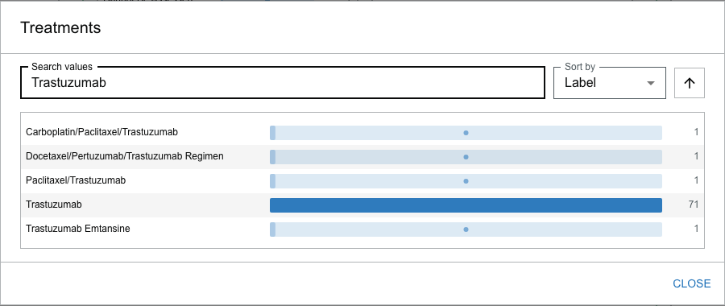
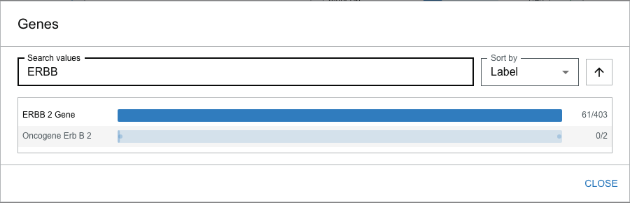
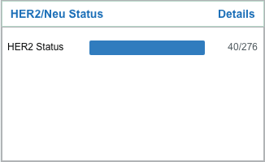
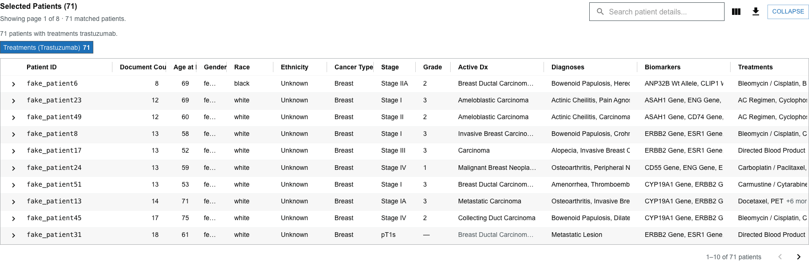

# Guided exercise: build a targeted-therapy cohort

The [first guided exercise](guided-exercise.md) followed a question down to individual patients. This one stays at the cohort level and answers a different kind of question — the kind a researcher asks when assembling a study group:

> **Pull everyone who received Herceptin — and check whether the record proves they should have.**

Trastuzumab (Herceptin) is a HER2-targeted antibody. A patient only receives it if their tumor is HER2-positive, so the treatment is, in effect, a claim about a biomarker. This exercise builds that cohort, tests the claim against the extracted data, and exports the result. Allow about 10 minutes.

## Before you start

This exercise is written against the bundled **synthetic demonstration dataset** of 500 breast cancer patients. Every count below comes from that dataset; against different data the numbers will differ but the workflow is identical — see [Adapt this to your own data](#adapt-this-to-your-own-data).

:::caution Synthetic data

These records are generated and are not always internally consistent. What is worth studying is how the Visualizer **represents** what was extracted, not the specific fabricated values.

:::

Start at the Cohort Explorer in its unfiltered state — **Reset filters** if needed, so the toolbar reads **All 500 patients**.

---

## Step 1 — Find a value in a facet you cannot scroll

In the **Treatment & Interventions** section, find the **Treatments** card and open its **Details** dialog.

The Treatments facet holds hundreds of distinct values — regimens, agents, procedures. Scrolling to a specific drug is hopeless. Type `Trastuzumab` into the dialog's search box.

**What you see.** The search narrows the list to `Trastuzumab` (71) and the combination regimens that contain it — `Docetaxel/Pertuzumab/Trastuzumab Regimen`, `Carboplatin/Paclitaxel/Trastuzumab`, and others, each at 1.

**Why this matters.** Long facets are the norm, not the exception, once you leave demographics behind. The search box — with the sort control beside it — is how you work a facet with hundreds of values instead of guessing whether a drug is present. Notice too that the drug appears both on its own and inside regimen names: the Visualizer keeps the specific regimen a patient received rather than flattening everything to a generic "chemotherapy," which is what lets you target one agent.

Select the standalone **`Trastuzumab`** row (not a combination regimen) and close the dialog.

---

## Step 2 — Read the biomarker the drug implies

The cohort is now **71 patients**. Every one of them received a HER2-targeted antibody, which should mean every one of them has HER2-positive disease. Check that against the extracted molecular data.

Open the **Genes** card's Details dialog and search for `ERBB` (the gene that encodes the HER2 receptor).

**What you see.** `ERBB 2 Gene` reads **61/403** — of the 403 patients in the whole dataset with that gene extracted, **61 are inside this 71-patient cohort**.

**Why this matters.** The treatment and the biomarker corroborate each other. You did not filter on HER2 — you filtered on a drug — and the HER2 gene concentrated in the result anyway. That is the cohort-level version of the provenance check from the first exercise: an independent signal in the data agrees with the clinical action, which is exactly what should happen and a reason to trust the group you have built.

---

## Step 3 — Notice what is *not* there

Now look at the **HER2/Neu Status** card in the same **Molecular Markers & Biomarkers** section.

**What you see.** `HER2 Status` reads **40/276** — a discrete HER2 status **finding** was extracted for only **40 of the 71** patients in the cohort.

**Why this matters.** This is the payoff of the exercise, and it is easy to miss. Seventy-one patients were treated as HER2-positive. Sixty-one carry the HER2 gene. But a structured HER2 *status* result exists for only forty. The other thirty-one are not HER2-negative — the value is simply **absent** from the extracted record.

Had you started the other way around — filtering on "HER2 status is present," or worse, treating a blank HER2 field as "negative" — you would have silently dropped a third of a genuine HER2-driven cohort. **A missing value is not a negative result.** In a medical dataset built by extraction, coverage is never complete, and the safest single habit is to reach for the more complete signal (here, the treatment) rather than the sparser one (the discrete status finding). See [Understand cohort results](../cohort-explorer/understanding-results.md) on why an absent value is not a confirmed negative.

---

## Step 4 — Review and export the cohort

Expand the **Selected Patients** drawer to work the table.

**What you see.** All 71 patients, one row each, with columns for demographics, stage, grade, diagnoses, **Biomarkers**, **Treatments**, procedures, and key findings. The Biomarkers column is full of `ERBB2 Gene` — the same signal from Step 2, now visible per patient.

Three controls in the drawer toolbar finish the workflow:

- **Sort** by clicking a column header — sort by **Document Count** to bring the richest records to the top, the natural place to start a manual review.
- **Choose columns** with the column button, to surface or hide fields (the Biomarkers and Treatments columns are what make this cohort worth reading).
- **Export to CSV** with the download button. The export contains the currently loaded, filtered, and sorted rows with the visible columns.

**Why this matters.** A cohort you cannot get out of the tool is a dead end. The export is what carries this group into a statistics package, a manuscript table, or a chart review worklist — and because it respects your current sort and column choices, the file matches what you were looking at. See [The Selected Patients table](../cohort-explorer/patients-table.md) and [Export results](../cohort-explorer/exporting-results.md) for the details.

---

## What this exercise demonstrated

| Step | Capability | The reason it matters |
| --- | --- | --- |
| 1 | Search a long facet in the Details dialog | Most clinical facets are too long to scroll; search is how you find a known value |
| 1 | Specific regimens are preserved, not flattened | You can target one agent because the extraction kept it distinct |
| 2 | An independent signal corroborates the filter | Filtering on a drug concentrated its biomarker — a cohort-level provenance check |
| 3 | Coverage is partial (40 of 71 have a HER2 status) | A missing value is **not** a negative result; prefer the more complete signal |
| 4 | Sort, choose columns, export to CSV | A cohort has to leave the tool to be useful, and the export matches your view |

---

## Adapt this to your own data

The workflow transfers to any treatment that implies a biomarker or target:

1. **Pick a targeted therapy** whose use encodes a molecular fact — an anti-HER2 antibody, an endocrine agent (implies hormone-receptor-positive disease), a PARP inhibitor (implies a BRCA context), and so on.
2. **Corroborate** by opening the relevant gene or biomarker facet and confirming the expected concept concentrates in the cohort.
3. **Measure the coverage gap.** Compare the treatment count with the count of the discrete biomarker finding. The difference is the set of patients for whom the value is absent rather than negative — the population most likely to be mishandled by a naive filter.
4. **Export** and record which signal you built the cohort from, so a downstream reader knows whether a blank field means "negative" or "not extracted." It almost always means the latter.

## Next steps

- [Guided exercise: compare treatment outcomes](exercise-compare-outcomes.md) — the companion cohort-comparison exercise
- [Select and combine filters](../cohort-explorer/selecting-filters.md) — AND/OR logic and disabled values
- [Filter Details dialog](../cohort-explorer/filter-details.md) — searching and sorting a facet's values
- [Export results](../cohort-explorer/exporting-results.md) — what the CSV contains and how it respects your view
