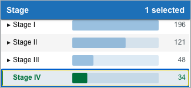
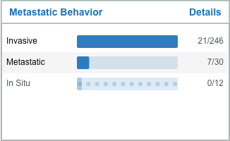
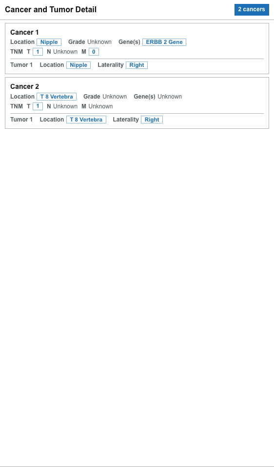
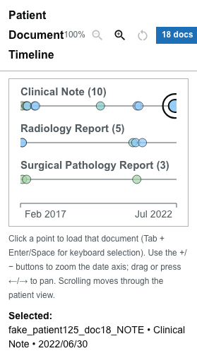
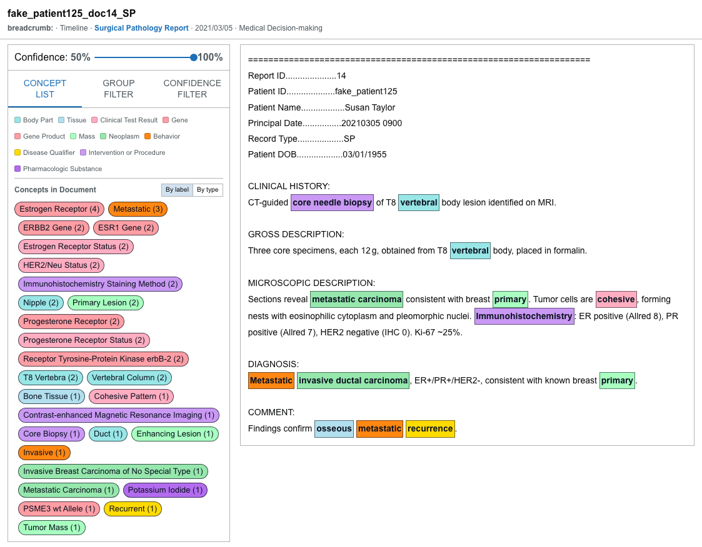
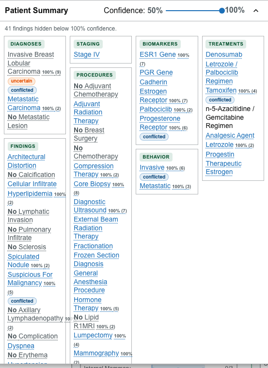
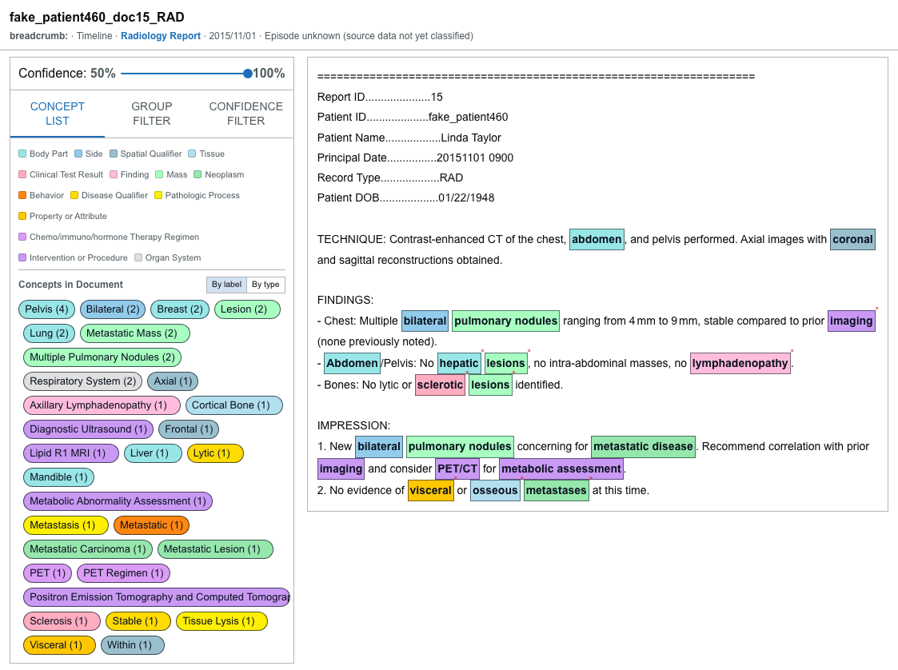

# Guided exercise: find the patients who need review

[Build your first cohort](first-cohort.md) covers the mechanics of selecting filters. This exercise puts those mechanics to work on a real question:

> **Of these patients, which ones does a human still need to look at?**

You will narrow a cohort, open two patients whose records tell opposite stories, and — at each step — read what the display is actually telling you. Allow about 15 minutes at your own pace.

## Before you start

This exercise is written against the bundled **synthetic demonstration dataset**: 500 breast cancer patients, each with roughly a dozen to two dozen notes. Every count and patient ID below comes from that dataset.

If you are running against different data, the numbers will not match. The exercise still works — see [Adapt this to your own data](#adapt-this-to-your-own-data) at the end.

:::caution Synthetic data

These records are generated. Names, dates of birth, and demographics are fabricated and are **not always internally consistent** with each other — a report header may show a date of birth that disagrees with the patient's age at diagnosis. That inconsistency is an artifact of the sample data, not of the extraction. What is worth studying here is how the Visualizer **represents** what was extracted.

:::

Start with the Cohort Explorer at its unfiltered state. If you have been clicking around, use **Reset filters** in the toolbar first. The toolbar should read **All 500 patients**.

---

## Step 1 — Read the unfiltered screen

Scroll from the top of the page to the bottom without selecting anything.

**What you see.** Filter cards grouped into sections: Patient, Cancer Type & Primary Site, Tumor Anatomy, Staging & Disease Extent, Pathology & Grade, Molecular Markers & Biomarkers, and Treatment & Interventions. Every value on every card is a clinical concept that natural-language processing pulled out of note text.

**Why this matters.** Nothing on this screen was typed into a registry field by a human abstractor. The breadth is the point: staging, biomarkers, treatments, and findings are all queryable at once because they were all extracted from the same notes. That is what makes the next step possible.

---

## Step 2 — Narrow to a clinically meaningful group

In **Staging & Disease Extent**, on the **Stage** card, select `Stage IV`.

**What you see.** Three things change at once:

1. The **Selected Patients** drawer opens at the bottom with **34** matching patients.
2. The toolbar reports the active criteria: `Filters: Stage (Stage IV)`.
3. **Every other card on the page repaints**, with each value now showing an in-cohort count over its total.

The repaint is easiest to read on a card you did not touch. Metastatic Behavior now reports each value as in-cohort over total:

**Why this matters.** That third change is the one to dwell on. Characterizing a cohort normally means running one query per variable — stage by receptor status, then stage by treatment, then stage by grade. Here, defining the cohort *is* the characterization: you can read its distribution across every extracted concept simultaneously, without leaving the screen or losing your selection.

This also protects you from a common analytic trap. When you have to ask for each cross-tabulation separately, you only ask about variables you already suspect matter. Seeing all of them repaint at once surfaces concentrations you were not looking for.

:::note Combining criteria

Values selected **within one card** are alternatives (OR). Values selected in **different cards** narrow the result (AND). Getting this backwards silently changes what your cohort means, so it is worth confirming — see [Select and combine filters](../cohort-explorer/selecting-filters.md).

:::

### Optional: check the hierarchy

Use the expand control beside `Stage III` on the same card. It opens into `Stage III` and `Stage IIIA`.

**Why this matters.** Selecting the parent includes the specific values underneath it. If it did not, a search for stage III disease would silently omit the stage IIIA patients — and you would have no way to know. A filter that quietly drops patients is a data-correctness failure, not a cosmetic one. Expanding a parent lets you confirm what a selection covers before you rely on it.

---

## Step 3 — Discovery 1: a record that corroborates itself

On the **Metastatic Behavior** card, select `Metastatic` (`7/30`). The cohort narrows from 34 to 7.

In the Selected Patients drawer, expand the row for **`fake_patient125`** and choose **Show in Document Viewer**.

### 3a. Two cancers, one of them a metastasis

**What you see.** **Cancer and Tumor Detail** reports **2 cancers**: Cancer 1 located in **Nipple**, Cancer 2 located in **T 8 Vertebra**.

**Why this matters.** Breast cancer does not originate in a thoracic vertebra. The structure records two cancer entries, but the clinical relationship between them — primary and metastatic deposit — is not something the structure alone states. This is a case where the extracted framework needs a reader who knows the domain, and it is exactly why the next two steps exist: the display should let you check the interpretation rather than asking you to trust it.

### 3b. The timeline has a shape

**What you see.** The **Patient Document Timeline** holds 18 documents across five years: a dense cluster in spring 2017, roughly four quiet years, then a tight cluster in early 2021 — two radiology reports followed by a surgical pathology report.

**Why this matters.** You can read the clinical course off the shape before opening a single document. A burst of imaging followed immediately by pathology is a workup; a long quiet stretch is stable disease or lost follow-up; a new burst after quiet is a recurrence being investigated. When you have a cohort of patients to review and limited time, that shape tells you which chart to open first and where in it to start reading.

### 3c. Close the loop on the source note

Select the **Surgical Pathology Report** point dated **2021/03/05**.

**What you see.** The note describes a CT-guided core needle biopsy of a T8 vertebral body lesion, reporting metastatic carcinoma consistent with a breast primary, ER positive, PR positive, HER2 negative. The **Concept List** shows the concepts found in it, including `T8 Vertebra` and `Metastatic`, and each one is highlighted where it appears in the text.

**Why this matters.** This closes the provenance chain. The "Cancer 2 — T 8 Vertebra" entry you read in Step 3a is now traceable to a specific sentence, in a specific report, on a specific date. Anything derived from extracted concepts — a cohort count, a summary line, a figure in a manuscript — is only as defensible as your ability to get back to the text that produced it. Practice making that trip, because it is the check you will be asked to perform when a result surprises someone.

**This patient is the straightforward case.** The structured record and the source note agree. Now look at one where they do not.

---

## Step 4 — Discovery 2: a record that disagrees with itself

Select `Metastatic` again to clear it, leaving only `Stage IV`. Then, in the **Patient** section on the **Age at Dx** card, select `30-39` — it now reads `1/19`.

**What you see.** **Selected Patients (1)**. Across the page, cards collapse to a single [patient dot](../cohort-explorer/patient-dots.md) each.

**Why this matters.** A cohort of one is not a failed search. Rare intersections are where two interesting things live: genuinely unusual presentations, and extraction errors. Both deserve a human. An exploratory tool should make small-N results easy to reach rather than treating them as a dead end.

Click any dot to open **`fake_patient460`**.

### 4a. The staging contradicts itself

**What you see.** In **Cancer and Tumor Detail**, Cancer 1 carries **TNM: T3, N unknown, M0**. In the **Patient Summary**, the staging section reads **Stage IV**.

**Why this matters.** M0 means no distant metastasis; stage IV means distant metastasis. Both were extracted from this patient's notes, and they cannot both be right. Notice what the Visualizer does *not* do: it does not silently pick a winner, and it does not hide the loser. If the interface resolved this for you, the disagreement would vanish from the record and no one would ever review it. Surfacing the conflict is what makes adjudication possible.

### 4b. Assertions and their negations, side by side

**What you see.** In the Patient Summary, the diagnoses section carries `Metastatic Carcinoma` at 100% confidence **and** `No Metastatic Lesion`. Negated items are struck through and read as "No …". Several items are tagged with an **`uncertain`** or **`conflicted`** chip.

**Why this matters.** "No metastatic lesion" is not the same as "no information about metastatic lesions." The first is a positive clinical assertion someone wrote in a note; the second is silence. Collapsing those two into one state is among the most consequential errors you can make with NLP-derived data, because it turns a documented rule-out into an apparent absence of evidence — or worse, treats an absence as a rule-out. The Visualizer renders negated items distinctly, and the `conflicted` chip marks where documents disagree with each other.

Treat a `conflicted` or `uncertain` chip as an instruction to open the source, not as a defect in the data.

### 4c. The default view is showing you a subset

**What you see.** In the screenshot above, just below the Patient Summary header: *"41 findings hidden below 100% confidence."* Drag the **Confidence** slider down from 100% toward 50%, and those findings appear.

**Why this matters.** The threshold starts at its maximum, so the summary opens showing only fully confident extractions. This is a deliberate, conservative default — but it means an unaware reader will undercount. If you are asking "does this patient have any documented X?", the answer at 100% and the answer at 60% can differ. Always know which threshold you are reading at before you draw a conclusion, and see [Patient Summary](../explore-patient/patient-summary.md) for how the threshold interacts with findings that carry no confidence score at all.

### 4d. The contradiction is inside a single document

The timeline shows a dense cluster in spring 2014, then over a year of silence, then a cluster in August 2015 and a final pair of notes in November. Select the **Radiology Report** dated **2015/11/01** — the second-to-last point.

**What you see.** In the **Concept List**, concepts extracted from this one report:

| Concept | Status |
| --- | --- |
| `Multiple Pulmonary Nodules (2)` | affirmed |
| `Metastatic Carcinoma (1)` | affirmed |
| `Metastasis (1)°` | **negated** |
| `Metastatic Lesion (1)°` | **negated** |
| `Metastatic Mass (2)°` | **negated** |

The `°` marker denotes a negated mention. Select `Multiple Pulmonary Nodules` and its mentions highlight in the note text.

Now read the note itself. It describes multiple bilateral pulmonary nodules, qualified as *stable compared to prior imaging* while also noting *none previously noted*. Its impression states that the new nodules are **concerning for metastatic disease**, and then that there is **no evidence of visceral or osseous metastases at this time**.

**Why this matters.** This is the payoff of the whole exercise. The radiologist hedged and, within a single paragraph, contradicted himself. The extraction did not resolve that hedge — it captured both the affirmed and the negated assertions and marked which was which, so the conflict survives all the way from the sentence to the patient summary to the `conflicted` chip you saw in Step 4b.

Had this been flattened into a single `metastatic: true/false` field, this patient would look unremarkable in every cohort query you could write, and no one would open her chart. The value of the display is not that it is certain. It is that it shows you precisely where the certainty runs out.

---

## What this exercise demonstrated

| Step | Capability | The reason it matters |
| --- | --- | --- |
| 2 | Every card repaints with in-cohort counts | Characterize a cohort across all variables at once, including ones you were not already suspicious of |
| 2 | Parent values include their children | A hierarchy that did not roll up would silently drop patients from your result |
| 3b | Timeline shape | Triage which record to read first, before reading any text |
| 3c | Concept traced to its source sentence | Extracted facts stay defensible only while they remain checkable |
| 4 | A cohort of one is reachable | Rare intersections hold both unusual cases and extraction errors |
| 4a | Conflicting extractions both shown | A resolved conflict is an invisible conflict |
| 4b | Negation rendered distinctly | A documented rule-out is not the same as missing information |
| 4c | Confidence threshold starts at 100% | The default view is a subset; know your threshold before concluding |
| 4d | Affirmed and negated mentions in one note | Uncertainty in the source survives into the display instead of being flattened |

---

## Adapt this to your own data

The click path matters more than the specific patients. To reproduce the exercise on a different dataset:

1. **For Discovery 1**, look for a patient with more than one cancer entry where the locations are anatomically inconsistent with a single primary, and whose timeline shows a gap followed by a cluster. Sort the Selected Patients table by document count and start with the richest records.
2. **For Discovery 2**, narrow to a stage or behavior value, then add a demographic filter until the cohort reaches one or two patients. Open them and look for `conflicted` or `uncertain` chips in the Patient Summary, or for a TNM value that disagrees with the recorded stage.
3. **In either case**, lower the Confidence slider before concluding a patient is uninteresting. The most instructive records are often the ones whose contradictions sit below 100%.

## Presenting this as a demonstration

The exercise compresses to roughly five minutes if you keep moving:

| Time | Section |
| --- | --- |
| 0:00–0:30 | Steps 1 and the synthetic-data caveat |
| 0:30–1:15 | Step 2 — select `Stage IV`, point out the repaint |
| 1:15–2:15 | Step 3 — `fake_patient125`, ending on the 2021 pathology report |
| 2:15–4:30 | Step 4 — `fake_patient460`, ending on the November 2015 radiology report |
| 4:30–5:00 | Close on the summary table above |

If you fall behind, cut Step 4c — the concept list in Step 4d carries the argument on its own. Keep **Reset filters** in reach as a recovery step.

## More exercises

- [Build a targeted-therapy cohort](exercise-targeted-therapy.md) — assemble a HER2-drug cohort through the search dialog, check its biomarkers, and export it
- [Compare treatment outcomes](exercise-compare-outcomes.md) — hold complete responders against progressors and read the difference off the cards

## Next steps

- [Understand cohort results](../cohort-explorer/understanding-results.md) — how counts are computed and what an empty result means
- [Patient Summary](../explore-patient/patient-summary.md) — confidence, negation, and source links in depth
- [Use the Document Viewer](../explore-patient/document-viewer.md) — concept groups, confidence filtering, and mention details
- [Export results](../cohort-explorer/exporting-results.md) — save a cohort for analysis elsewhere
