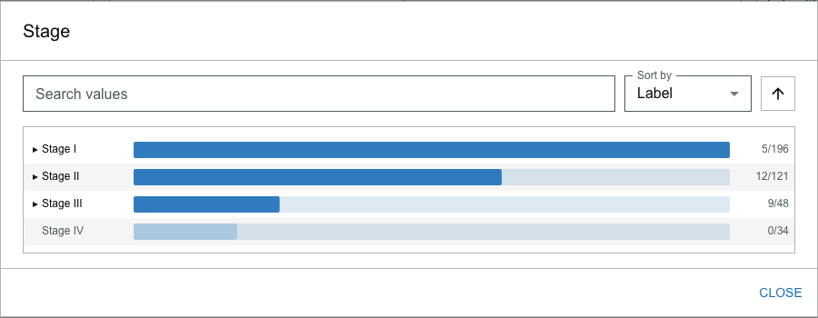
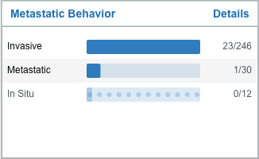
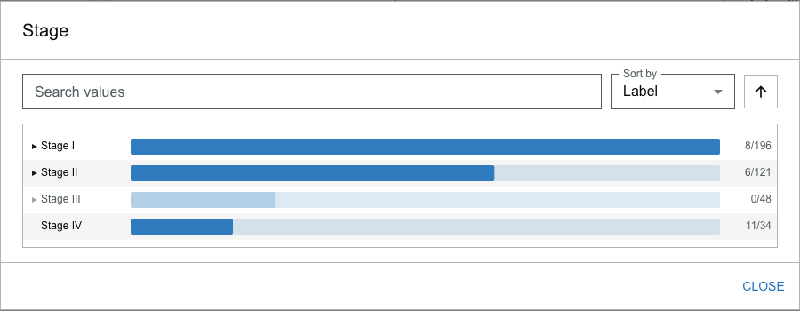
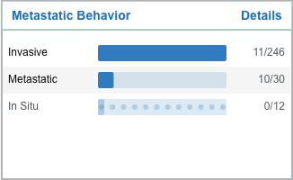

# Compare Responders and Progressors

Comparing subgroups is a core reason researchers reach for a tool like this. The [HER2-targeted therapy workflow](build-her2-targeted-therapy-cohort.md) built one cohort; this one builds two and holds them up against each other:

> **Some tumors responded completely to treatment. Others kept growing. What separates the two groups?**

You will define each group in turn and read the difference directly off the cards — no export, no statistics package, just the repaint. Allow about 10 minutes.

## Before you start

Written against the bundled **synthetic demonstration dataset** of 500 breast cancer patients. Counts below come from that dataset; they will differ on other data but the method is the same — see [Adapt this to your own data](#adapt-this-to-your-own-data).

:::caution Synthetic data

These records are generated. Study how the Visualizer **represents** the groups, not the specific fabricated values.

:::

Start unfiltered — **Reset filters** so the toolbar reads **All 500 patients**.

---

## Step 1 — Define the responders

Scroll to the **Clinical Course of Disease** card and select **`Pathologic Complete Response`** — patients whose tumor was gone at surgery after treatment, the best outcome on offer.

The cohort settles at **33 patients**. Open the **Stage** card's Details dialog.

**What you see.** Stage I `5/196`, Stage II `12/121`, Stage III `9/48` — and **Stage IV dimmed at `0/34`**. The Stage IV row is greyed and cannot be selected.

**Why this matters.** That dimmed row is the Visualizer telling you something with an absence. A value goes disabled when **no patient in the current cohort carries it** — selecting it could only ever produce zero, so the interface takes it off the table (see [Values that can't add anyone are disabled](../cohort-explorer/selecting-filters.md#values-that-cant-add-anyone-are-disabled)). Here it means the clinical headline outright: **not one complete responder was stage IV**. You did not have to run a query to learn that — a whole stage simply went dark.

---

## Step 2 — Read the rest of the responders' profile

Without changing the selection, look at the **Metastatic Behavior** card.

**What you see.** `Metastatic` reads **1/30** — a single responder shows metastatic behavior. The Grade card, meanwhile, is spread evenly across `G1` (6), `G2` (8), and `G3` (8).

**Why this matters.** The picture is internally consistent: the group that responded completely is early-stage and almost never metastatic. Note what you are *not* doing — you are not cross-tabulating outcome against stage, then outcome against metastasis, then outcome against grade as three separate queries. You defined the group once and every card now describes it at a glance. That is the cohort-comparison workflow: characterize a group by reading its repaint, not by asking one question at a time.

---

## Step 3 — Define the progressors

**Reset filters**, then, on the same **Clinical Course of Disease** card, select **`Progressive Disease`** — patients whose disease advanced despite treatment.

This cohort settles at **29 patients**. Open the **Stage** dialog again.

**What you see.** A different shape entirely. **Stage IV is present and solid at `11/34`** — the largest single stage in this group. This time it is **Stage III** that is dimmed at `0/48`.

**Why this matters.** Set this dialog beside the one from Step 1 and the contrast is the whole exercise. For responders, stage IV was the impossible value; for progressors, it is the dominant one. The same disabled-value mechanism now points the opposite way, and eleven of twenty-nine progressors carry the stage that not one responder did. The interface has drawn the line between good and bad outcomes for you, in the position of a single dimmed bar.

---

## Step 4 — Confirm the pattern holds

Look at the progressors' **Metastatic Behavior** card.

**What you see.** `Metastatic` reads **10/30**, against the responders' `1/30`. And the Grade card has shifted toward the high end — `G3` (12) now outweighs `G1` (3).

**Why this matters.** Every card tells the same story the stage dialog did: the group that progressed is later-stage, far more often metastatic, and higher-grade. When independent variables all move together like this, you are looking at a real signal in the cohort rather than an artifact of one facet. Reading three cards took you seconds, and you never left the screen.

:::note Counts on the bar vs. the cohort

The `Pathologic Complete Response` bar reads **36** but the cohort settled at **33**; `Progressive Disease` reads **30** but gives **29**. The number on a facet bar counts extracted *mentions* of the concept, and one patient can carry a concept in more than one place. The drawer and the toolbar count **distinct patients**. When you cite a cohort size, use the toolbar's count. See [Understand cohort results](../cohort-explorer/understanding-results.md).

:::

---

## What this exercise demonstrated

| Step | Capability | The reason it matters |
| --- | --- | --- |
| 1 | A disabled value marks an empty intersection | A whole stage going dark states a finding without a query |
| 2 | One selection characterizes a group across every card | Compare subgroups by reading the repaint, not one cross-tab at a time |
| 3 | The disabled value points the other way for the other group | The contrast between two cohorts is legible in a single dimmed bar |
| 4 | Independent facets move together | Concordant shifts across cards signal a real pattern, not a facet artifact |
| 4 | Bar count (mentions) ≠ cohort count (patients) | Cite the toolbar's distinct-patient count when you report a cohort size |

---

## Adapt this to your own data

The comparison method transfers to any pair of contrasting groups:

1. **Pick two opposing values** of the same clinical axis — responders vs. progressors, recurrent vs. disease-free, one biomarker status vs. another.
2. **Select the first, read three or four cards, then reset and select the second.** Keep the same cards in view both times so the differences are easy to spot.
3. **Watch for disabled values.** A value that is available for one group and dimmed for the other is a difference the interface has already found for you.
4. **Trust concordance, distrust a lone signal.** When stage, grade, and metastatic behavior all shift the same way, the pattern is robust; a difference on a single facet may be an extraction artifact. Confirm anything decision-relevant against the source records.

## Presenting this as a demonstration

The exercise compresses to about four minutes:

| Time | Section |
| --- | --- |
| 0:00–0:30 | Premise and the synthetic-data caveat |
| 0:30–1:45 | Step 1–2 — responders: Stage IV dimmed, metastatic 1/30 |
| 1:45–3:15 | Step 3–4 — progressors: Stage IV 11/34, metastatic 10/30 |
| 3:15–4:00 | Put the two Stage dialogs side by side and close on the contrast |

The single strongest beat is opening the two Stage dialogs back to back — the dimmed bar jumps from Stage IV to Stage III between them. Keep **Reset filters** in reach for the switch.

## Next steps

- [Build a HER2-Targeted Therapy Cohort](build-her2-targeted-therapy-cohort.md) — the companion cohort-building workflow
- [Select and combine filters](../cohort-explorer/selecting-filters.md) — how and why values become disabled
- [Understand cohort results](../cohort-explorer/understanding-results.md) — counts, mentions vs. patients, and empty results
- [Filter Details dialog](../cohort-explorer/filter-details.md) — the full value list behind each card
