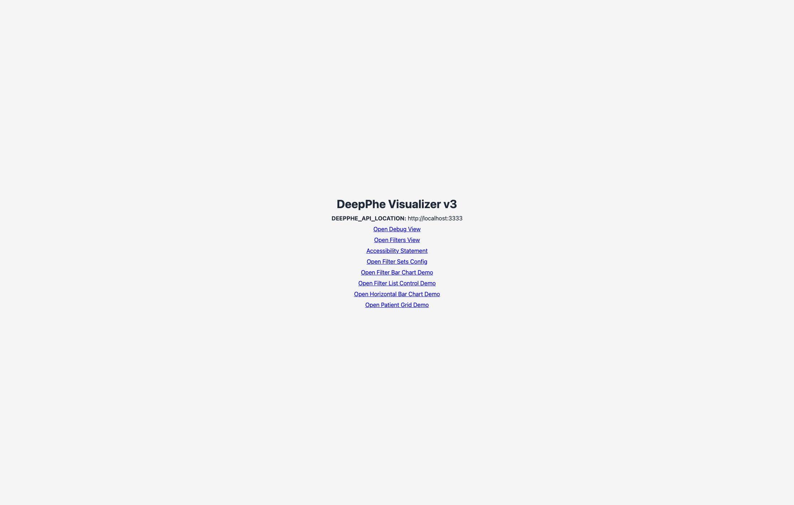

# DeepPhe Visualizer v3 UI Review

This documentation site is generated from automated Playwright captures of the live app routes at `http://localhost:3000`.

*Figure 01. Home route with direct links to all QA-reviewed screens.*

## Deliverables

- Automated screenshots: `output/playwright/`
- Copied documentation images: `docs/assets/screenshots/`
- Built docs site: `site/`
- Leadership PDF: `output/reports/deepphe-ui-review.pdf`

## Coverage Map

- Route-level walkthrough: [Route Coverage](routes.md)
- Primary filtering workflow: [Filters Workflow](filters.md)
- Patient table behavior: [Patient Details](patient-details.md)
- Executive narrative: [Full Report](full-report.md)
