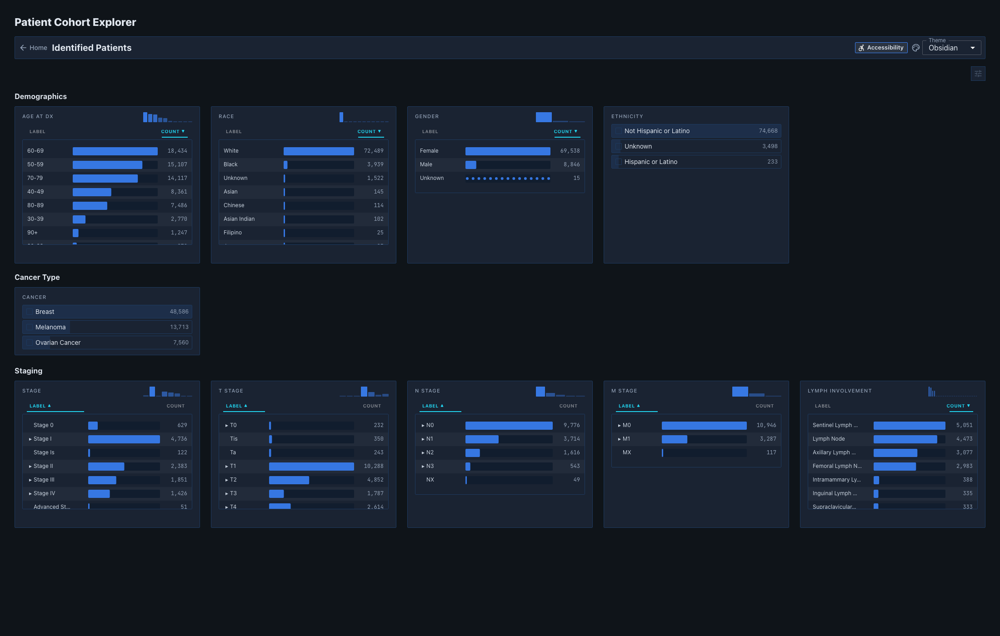

# DeepPhe Visualizer user guide

The DeepPhe Visualizer helps you find groups of patients whose clinical records match selected demographic, cancer, staging, pathology, biomarker, and treatment criteria — and then trace any finding back to the note it came from.

Most work happens in the **Cohort Explorer**, the screen that opens when you start the application.

## Start here

New to the Visualizer? Begin with [Cohort Explorer overview](getting-started/overview.md) and [Build your first cohort](getting-started/first-cohort.md).

Once the basics make sense, work through the guided exercises — each walks a real question through the whole workflow and explains why every finding matters:

- [Find the patients who need review](getting-started/guided-exercise.md) — narrow a cohort down to two contrasting patient records
- [Build a targeted-therapy cohort](getting-started/exercise-targeted-therapy.md) — assemble a HER2-drug group, check its biomarkers, and export it
- [Compare treatment outcomes](getting-started/exercise-compare-outcomes.md) — hold complete responders against progressors

## What you can do

The guide follows the tasks you do, in order:

1. **[Build a cohort](cohort-explorer/screen-overview.md)** — choose and combine clinical filter values and watch the matching patient count update.
2. **[Review patient results](cohort-explorer/understanding-results.md)** — read the counts, open the **Selected Patients drawer**, and inspect, search, sort, and expand patient rows.
3. **[Explore a patient](explore-patient/overview.md)** — open one patient to see their cancer and tumor detail, document timeline, structured Patient Summary, and the **Document Viewer**, and follow any finding to its source note.

To adjust appearance or accessibility, see [Customize & Accessibility](customization/display-settings.md). For quick answers, see [Troubleshooting](reference/troubleshooting.md) or the one-page [Printable guide](printable-guide.md).

:::caution Clinical interpretation

Visualizer results combine structured data with clinical concepts extracted from notes by natural-language processing. Both can be incomplete or imperfect. Confirm important findings against the source medical record and your organization's review procedures. An absent value is **not** a confirmed negative clinical finding.

:::
