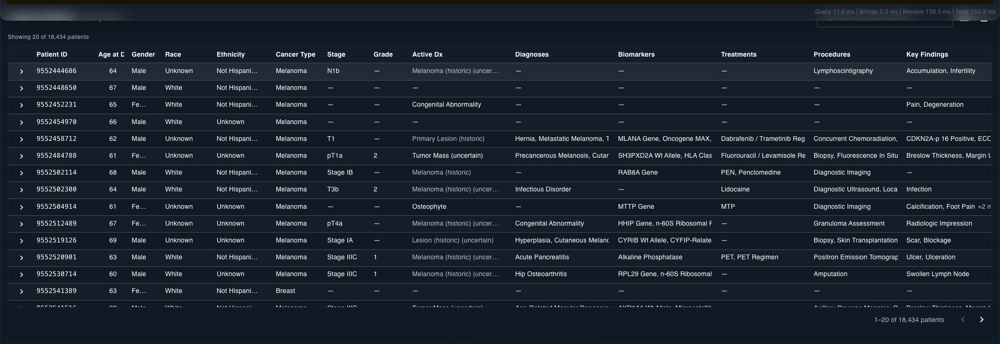
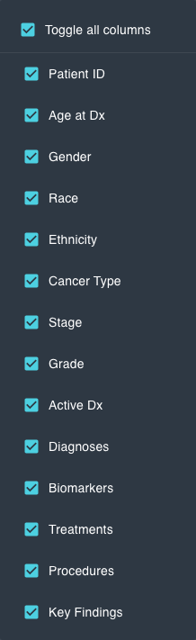
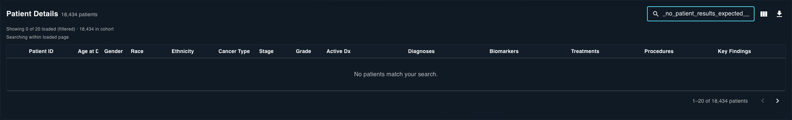

# Patient Details Coverage

This section verifies the `Patient Details` table area and required controls.

## Overview

*Figure 22. Patient details table shell with search, column chooser, export action, and table headers.*

## Required Controls

- Search input placeholder: `Search patient details...`
- Button `aria-label`: `Toggle visible patient columns`
- Button `aria-label`: `Export filtered cohort rows to CSV`

*Figure 23. Column chooser menu opened, including the `Toggle all columns` option.*

## Table Header Coverage

Expected headers reviewed in capture set:

- `Patient ID`
- `Age at Dx`
- `Gender`
- `Race`
- `Ethnicity`
- `Cancer Type`
- `Stage`
- `Grade`
- `Active Dx`
- `Diagnoses`
- `Biomarkers`
- `Treatments`
- `Procedures`
- `Key Findings`

## Expanded Row Sections

Required expanded section labels:

- `Diagnoses`
- `Staging`
- `Grading`
- `Biomarkers`
- `Treatments`
- `Procedures`
- `Findings`
- `Behavior`

*Figure 24. Expanded row state displaying detailed clinical sections when available.*

## Empty Search State

*Figure 25. Empty-result confirmation text: `No patients match your search.`*
