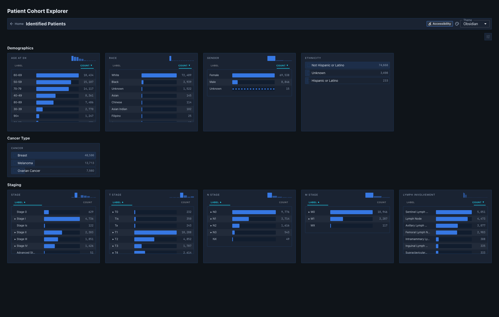
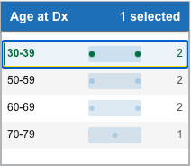

# DeepPhe Visualizer — quick guide

Build a cohort, review patient results, then explore an individual patient.

## 1. Build a cohort

1. Find a filter card and select a value.
2. Add values in the **same** card as alternatives (**OR**).
3. Add selections from **different** cards to narrow the cohort (**AND**).

- The toolbar shows **All *N* patients**, then ***N* of *total* patients selected**.
- A value that can no longer add a matching patient is **disabled**; a value you already selected stays removable.
- Select a value again to remove it. **Reset filters** clears all selections.
- After criteria are active, a value may read `included / total` — how many of that value's patients remain in the cohort.

## 2. Low-count patient dots

When a value represents **20 or fewer** patients, each patient is a **dot**. **Hover** a dot to preview the patient; **click** a dot on a card to open that patient as a drawer tab (this never changes the cohort). **Bars behind dots** adds a faint bar for scale.

## 3. Review patient results

Open the **Selected Patients drawer**. It loads **10 patients per page** (**40** when maximized).

- **Search** and **sort** apply to the **loaded page** only.
- Click a row to **expand** it; only one row is expanded at a time.
- Indicators: **negated**, **historic**, **uncertain**, **conflicted**, and **source**.

## 4. Explore a patient

Open a patient from a **dot** or from **Show in Document Viewer** in an expanded row.

- **Patient Summary** items that resolve to notes are links: a single source opens directly; a multi-source item opens a **confidence-ranked** picker.
- On the **timeline**, click a document to open it; the open note has a larger ringed marker, and fact-linked notes have dashed outlines.
- In the **Document Viewer**, filter highlights with **Concept List**, **Group Filter** (CHECK ALL / UNCHECK ALL), and **Confidence Filter** (By Mention / By Concept).

## 5. Export

CSV export includes the **currently loaded page** only, after its search and sort, with visible columns.

## Important limitations

- Available filters depend on the loaded dataset and services.
- Extracted concepts and structured findings may require validation against source notes.
- An absent value is **not** a confirmed negative clinical fact.
- Exported files may contain patient-identifying information; handle them accordingly.
