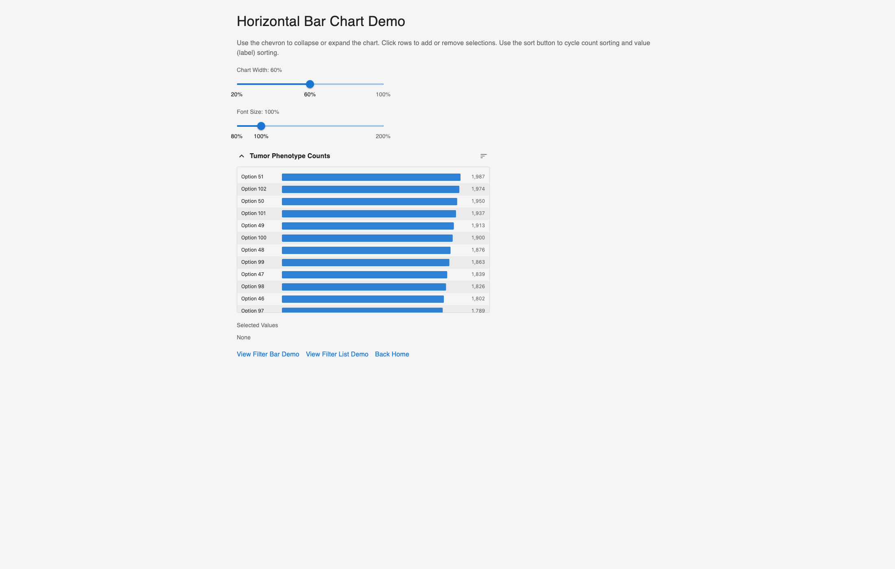
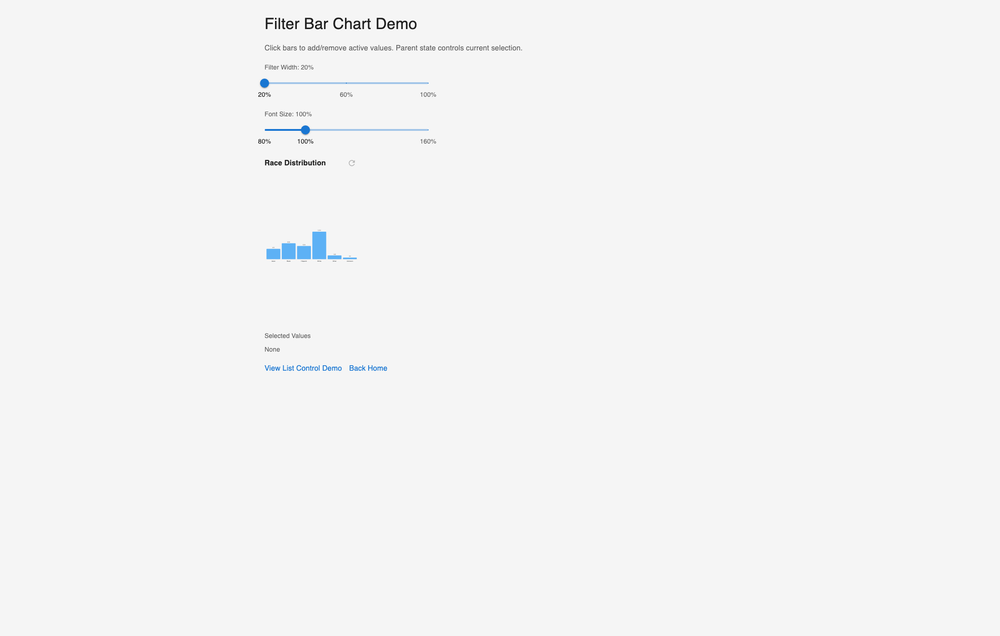
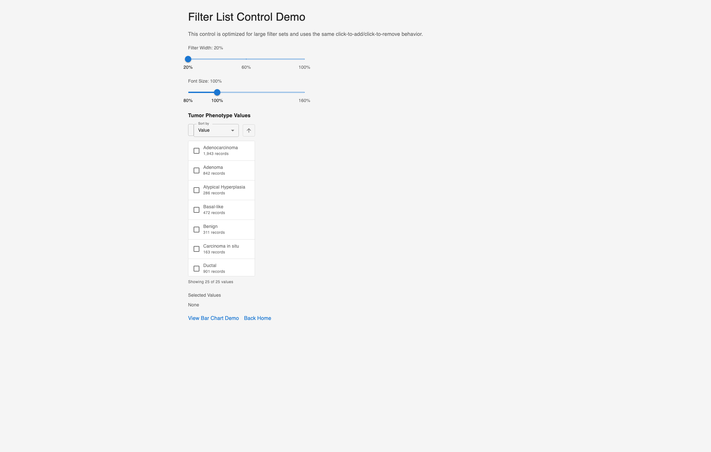
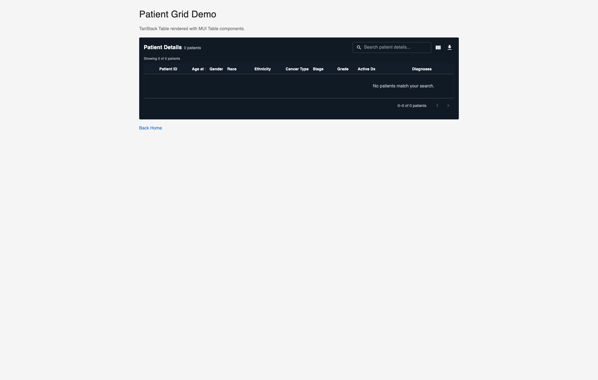
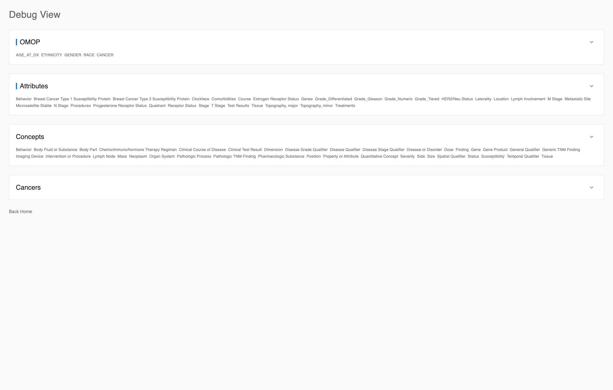
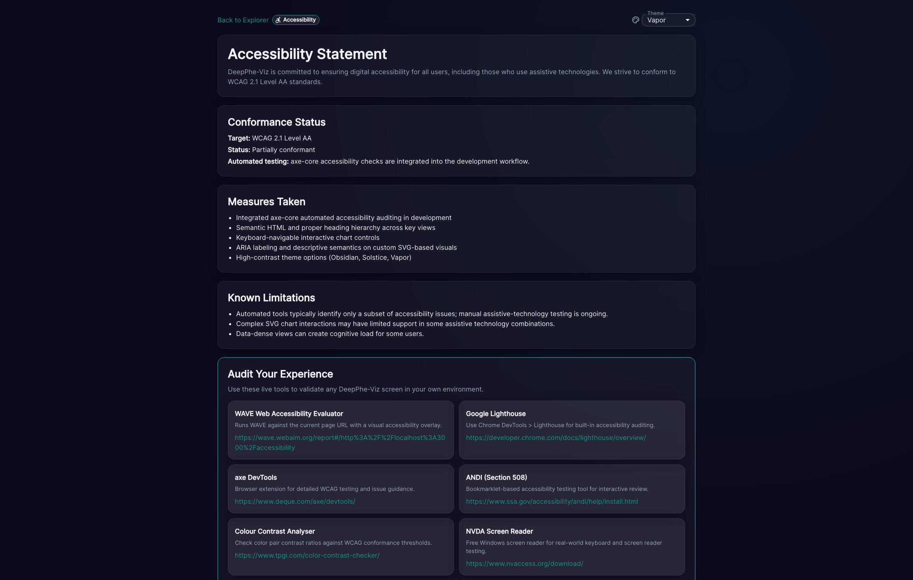

# Route Coverage

This section captures non-filter routes used for component demos, debugging, and accessibility verification.

## `/horizontal-bar-chart-demo`

*Figure 26. Interactive horizontal chart demo with width/font controls and selection chips.*

## `/filter-bar-chart-demo`

*Figure 27. Vertical bar-based filter demo showing value toggling behavior.*

## `/filter-list-control-demo`

*Figure 28. Large-value list control with search and sort interactions.*

## `/patient-grid-demo`

*Figure 29. Standalone patient grid shell used as fallback validation surface.*

## `/debug`

*Figure 30. Debug view landing section for OMOP, attributes, concepts, and cancers diagnostics.*

## `/accessibility`

*Figure 31. Accessibility statement page with tooling references and conformance details.*
